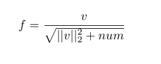

# 1. (2 points) Take a picture of a cluttered scenario with the presence of several objects, resize the picture as to be 448x336 pixels. Read and show the picture using OpenCV

```python
image = cv2.imread("image.jpg", 0)
image = cv2.resize(image, (448, 336))
cv2.imshow("Original", image)
```


# 2. (4 points) Apply a Gabor filter at 4 orientations. Combine (use the maximum value for each pixel) the four orientations into one filtered image and show the result. Play with the parameters of the filter and show how the filter works with 3 different parameter set values

```python
value_pairs = [
    {"ksize": 5, "sigma": 1, "lambd": 0.5, "gamma": np.pi/4, "psi": np.pi/2},
    {"ksize": 3, "sigma": 0.5, "lambd": 2, "gamma": 0.5, "psi": np.pi/2},
    {"ksize": 7, "sigma": 2, "lambd": 0.5, "gamma": 2, "psi": np.pi/2}
]

for i, value_pair in enumerate(value_pairs):
    gabor_filter_and_combine_images(image, **value_pair)
    print(f"finished {i+1}: {value_pair}")


def gabor_filter(image, ksize, sigma, theta, lambd, gamma, psi):
    k = cv2.getGaborKernel((ksize, ksize), sigma, theta, lambd, gamma, psi)
    filtered_image = cv2.filter2D(image, -1, k)
    return filtered_image


def gabor_filter_and_combine_images(image, ksize, sigma, lambd, gamma, psi):
    filtered_images = []
    for theta in [0, 45, 90, 135]:
        filtered_image = gabor_filter(
            image, ksize, sigma, theta=theta, lambd=lambd, gamma=gamma, psi=psi)
        filtered_images.append(filtered_image)

    # Combine filtered images using the maximum value for each pixel
    combined_image = np.zeros(image.shape, image.dtype)
    for i in range(image.shape[0]):
        for j in range(image.shape[1]):
            max_value = 0
            for filtered_image in filtered_images:
                max_value = max(max_value, filtered_image[i, j])
            combined_image[i, j] = max_value
    filename = f"ksize: {ksize}, sigma: {sigma}, lambd: {lambd}, gamma: {gamma}, psi: {psi}"
    cv2.imshow(filename, combined_image)
```

### Results:


```python
{"ksize": 3, "sigma": 0.5, "lambd": 2, "gamma": 0.5, "psi": np.pi/2},
```


```python
{"ksize": 5, "sigma": 1, "lambd": 0.5, "gamma": np.pi/4, "psi": np.pi/2},
```


```python
{"ksize": 7, "sigma": 2, "lambd": 0.5, "gamma": 2, "psi": np.pi/2}
```

# 3. (4 points) Apply the Canny Edge detector. Show the result and compare to the result from the Gabor

```python
t_lower = 100
t_upper = 200
aperture_size = 3
L2Gradient = True
edge = cv2.Canny(image,
                 t_lower,
                 t_upper,
                 apertureSize=aperture_size,
                 L2gradient=L2Gradient)

cv2.imshow('edge', edge)
```

The edges are way more defined in this filter, if you zoom in you can see that the border is very harsh, the white pixels are 255 and the black ones 0 and no values on between.


# 5. (5 points) Extract features from the images using the SIFT and HOG descriptors

## a. Show the results, compare and comment on both descriptors


## b. Briefly describe in your own words the HOG descriptor (min. half a page, include mathematical expressions)

### What it is

The Histogram of Oriented Gradients (HOG) descriptor is a powerful feature extraction technique widely used in computer vision applications, particularly for object detection and classification. It captures the shape and appearance of objects by analyzing the distribution of gradient orientations in localized regions of an image. It has been successfully applied to a wide range of applications, including:

- Pedestrian detection
- Face detection
- Vehicle detection
- Traffic sign recognition
- Image classification

The HOG descriptor's robustness to illumination and partial occlusions makes it a valuable tool for real-world applications where these factors are often present. Its computational efficiency allows for real-time object detection and classification in various scenarios.

### How it works

The first step is to compute the gradients. This can be done by using two derivation matrixes and
applying them to the image. The derivation matrixes are:


Now for each pixel the gradient magnitude and orientation is computed using pixel differences. This also
applies the matrices from above.


Now the picture is divided into cells. Each pixel within the cell influences the histogram with its angle weighted with its magnitude. Then 4 of these cells get normalized into a block descriptor. The normalization function can be the L2 norm (below), with v being the 4 histograms of the block and num a small number to not divide by 0. The features computed by the progress are displayed as an overlay in the image below. They can be used as a input into some machine learning algorithm for object recognition.



Example:


```python
import matplotlib.pyplot as plt

from skimage.feature import hog
from skimage import exposure, io

image = io.imread("paris.jpg")

fd, hog_image = hog(image, orientations=8, pixels_per_cell=(16, 16),
                    cells_per_block=(1, 1), visualize=True, channel_axis=-1)

fig, (ax1, ax2) = plt.subplots(1, 2, figsize=(8, 4), sharex=True, sharey=True)

ax1.axis('off')
ax1.imshow(image, cmap=plt.cm.gray)
ax1.set_title('Input image')

hog_image_rescaled = exposure.rescale_intensity(hog_image, in_range=(0, 10))

ax2.axis('off')
ax2.imshow(hog_image_rescaled, cmap=plt.cm.gray)
ax2.set_title('Histogram of Oriented Gradients')
plt.show()
```
