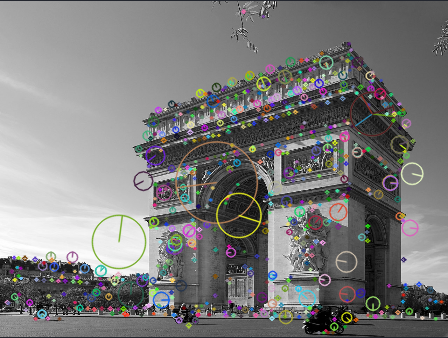

# 1. (2 points) Take a picture of a cluttered scenario with the presence of several objects, resize the picture as to be 448x336 pixels. Read and show the picture using OpenCV

```{ .python .numberLines }
image = cv2.imread("image.jpg", 0)
image = cv2.resize(image, (448, 336))
cv2.imshow("Original", image)
```


# 2. (4 points) Apply a Gabor filter at 4 orientations. Combine (use the maximum value for each pixel) the four orientations into one filtered image and show the result. Play with the parameters of the filter and show how the filter works with 3 different parameter set values

```python
value_pairs = [
    {"ksize": 5, "sigma": 1, "lambd": 0.5, "gamma": np.pi/4, "psi": np.pi/2},
    {"ksize": 3, "sigma": 0.5, "lambd": 2, "gamma": 0.5, "psi": np.pi/2},
    {"ksize": 7, "sigma": 2, "lambd": 0.5, "gamma": 2, "psi": np.pi/2}
]

for i, value_pair in enumerate(value_pairs):
    gabor_filter_and_combine_images(image, **value_pair)
    print(f"finished {i+1}: {value_pair}")


def gabor_filter(image, ksize, sigma, theta, lambd, gamma, psi):
    k = cv2.getGaborKernel((ksize, ksize), sigma, theta, lambd, gamma, psi)
    filtered_image = cv2.filter2D(image, -1, k)
    return filtered_image


def gabor_filter_and_combine_images(image, ksize, sigma, lambd, gamma, psi):
    filtered_images = []
    for theta in [0, 45, 90, 135]:
        filtered_image = gabor_filter(
            image, ksize, sigma, theta=theta, lambd=lambd, gamma=gamma, psi=psi)
        filtered_images.append(filtered_image)

    # Combine filtered images using the maximum value for each pixel
    combined_image = np.zeros(image.shape, image.dtype)
    for i in range(image.shape[0]):
        for j in range(image.shape[1]):
            max_value = 0
            for filtered_image in filtered_images:
                max_value = max(max_value, filtered_image[i, j])
            combined_image[i, j] = max_value
    filename = f"ksize: {ksize}, sigma: {sigma}, lambd: {lambd}, gamma: {gamma}, psi: {psi}"
    cv2.imshow(filename, combined_image)
```


```python
{"ksize": 3, "sigma": 0.5, "lambd": 2, "gamma": 0.5, "psi": np.pi/2},
```


```python
{"ksize": 5, "sigma": 1, "lambd": 0.5, "gamma": np.pi/4, "psi": np.pi/2},
```


```python
{"ksize": 7, "sigma": 2, "lambd": 0.5, "gamma": 2, "psi": np.pi/2}
```

# 3. (4 points) Apply the Canny Edge detector. Show the result and compare to the result from the Gabor

```python
t_lower = 100
t_upper = 200
aperture_size = 3
L2Gradient = True
edge = cv2.Canny(image,
                 t_lower,
                 t_upper,
                 apertureSize=aperture_size,
                 L2gradient=L2Gradient)

cv2.imshow('edge', edge)
```


# 5. (5 points) Extract features from the images using the SIFT and HOG descriptors

## a. Show the results, compare and comment on both descriptors



## b. Briefly describe in your own words the HOG descriptor (min. half a page, include mathematical expressions)

The Histogram of Oriented Gradients (HOG) descriptor is a powerful feature extraction technique widely used in computer vision applications, particularly for object detection and classification. It captures the shape and appearance of objects by analyzing the distribution of gradient orientations in localized regions of an image. The HOG descriptor is robust to changes in illumination and partial occlusions, making it a valuable tool for real-world applications.

The HOG descriptor extraction process involves the following steps:

1. **Image Normalization:** The input image is normalized to a fixed contrast level to minimize the impact of illumination variations.

2. **Gradient Computation:** Gradients are calculated for each pixel in the image using the horizontal and vertical components of the image intensity values. The magnitude and direction of the gradient at each pixel are computed using the following formulas:

```
Gx = Ix2 - Iy2
Gy = 2 * Ix * Iy
Magnitude = sqrt(Gx^2 + Gy^2)
Direction = arctan(Gy / Gx)
```

3. **Cell Division:** The image is divided into small rectangular cells, typically 8x8 pixels in size. These cells act as localized regions for analyzing gradient orientations.

4. **Gradient Orientation Histogram:** For each cell, the gradient directions of all pixels within the cell are quantized into a fixed number of bins, typically 9 bins covering a range of 180 degrees. The number of pixels falling into each orientation bin is counted, forming a histogram of gradient orientations.

5. **Block Normalization:** To compensate for variations in local contrast, cells are grouped into larger rectangular blocks, typically 2x2 cells in size. The histograms of all cells within a block are normalized using L2-norm. This normalization ensures that the descriptor is not overly sensitive to local intensity changes.

6. **Feature Vector Construction:** The normalized histograms from all blocks are concatenated into a single feature vector, representing the overall gradient orientation distribution of the image. This feature vector is used as input for machine learning algorithms for object detection and classification.

The HOG descriptor has gained popularity in computer vision due to its effectiveness and computational efficiency. It has been successfully applied to a wide range of applications, including:

- Pedestrian detection
- Face detection
- Vehicle detection
- Traffic sign recognition
- Image classification

The HOG descriptor's robustness to illumination and partial occlusions makes it a valuable tool for real-world applications where these factors are often present. Its computational efficiency allows for real-time object detection and classification in various scenarios.