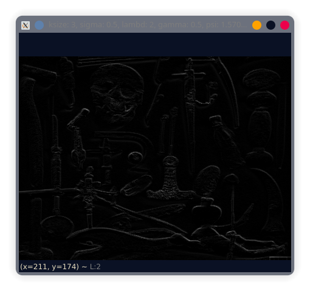
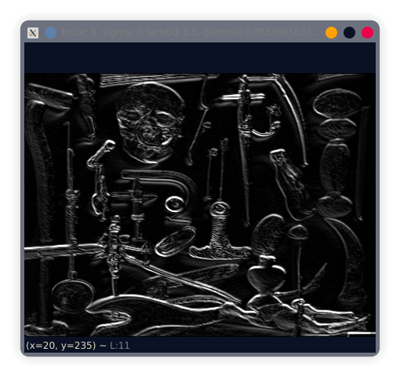
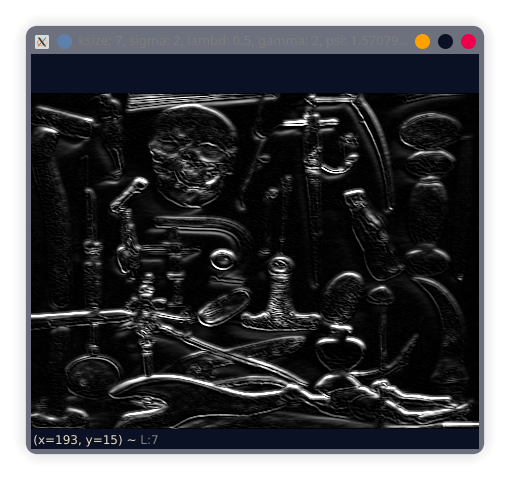

# 1. (2 points) Take a picture of a cluttered scenario with the presence of several objects, resize the picture as to be 448x336 pixels. Read and show the picture using OpenCV

```{ .python .numberLines }
image = cv2.imread("image.jpg", 0)
image = cv2.resize(image, (448, 336))
cv2.imshow("Original", image)
```


# 2. (4 points) Apply a Gabor filter at 4 orientations. Combine (use the maximum value for each pixel) the four orientations into one filtered image and show the result. Play with the parameters of the filter and show how the filter works with 3 different parameter set values

```python
value_pairs = [
    {"ksize": 5, "sigma": 1, "lambd": 0.5, "gamma": np.pi/4, "psi": np.pi/2},
    {"ksize": 3, "sigma": 0.5, "lambd": 2, "gamma": 0.5, "psi": np.pi/2},
    {"ksize": 7, "sigma": 2, "lambd": 0.5, "gamma": 2, "psi": np.pi/2}
]

for i, value_pair in enumerate(value_pairs):
    gabor_filter_and_combine_images(image, **value_pair)
    print(f"finished {i+1}: {value_pair}")


def gabor_filter(image, ksize, sigma, theta, lambd, gamma, psi):
    k = cv2.getGaborKernel((ksize, ksize), sigma, theta, lambd, gamma, psi)
    filtered_image = cv2.filter2D(image, -1, k)
    return filtered_image


def gabor_filter_and_combine_images(image, ksize, sigma, lambd, gamma, psi):
    filtered_images = []
    for theta in [0, 45, 90, 135]:
        filtered_image = gabor_filter(
            image, ksize, sigma, theta=theta, lambd=lambd, gamma=gamma, psi=psi)
        filtered_images.append(filtered_image)

    # Combine filtered images using the maximum value for each pixel
    combined_image = np.zeros(image.shape, image.dtype)
    for i in range(image.shape[0]):
        for j in range(image.shape[1]):
            max_value = 0
            for filtered_image in filtered_images:
                max_value = max(max_value, filtered_image[i, j])
            combined_image[i, j] = max_value
    filename = f"ksize: {ksize}, sigma: {sigma}, lambd: {lambd}, gamma: {gamma}, psi: {psi}"
    cv2.imshow(filename, combined_image)
```



```python
{"ksize": 3, "sigma": 0.5, "lambd": 2, "gamma": 0.5, "psi": np.pi/2},
```



```python
{"ksize": 5, "sigma": 1, "lambd": 0.5, "gamma": np.pi/4, "psi": np.pi/2},
```



```python
{"ksize": 7, "sigma": 2, "lambd": 0.5, "gamma": 2, "psi": np.pi/2}
```

# 3. (4 points) Apply the Canny Edge detector. Show the result and compare to the result from the Gabor

```python
t_lower = 100
t_upper = 200
aperture_size = 3
L2Gradient = True
edge = cv2.Canny(image,
                 t_lower,
                 t_upper,
                 apertureSize=aperture_size,
                 L2gradient=L2Gradient)

cv2.imshow('edge', edge)
```


# 5. (5 points) Extract features from the images using the SIFT and HOG descriptors

## a. Show the results, compare and comment on both descriptors

## b. Briefly describe in your own words the HOG descriptor (min. half a page, include mathematical expressions)
